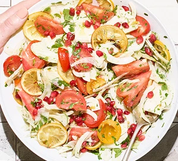

   

          

            

            <form class="search">
              <input
                type="text"
                class="search__field"
                placeholder="Search over 1,000,000 recipes..."
              />
              <button class="btn--recipes search__btn">
                <svg class="search__icon">
                  <use href="/src/img/icons.svg#icon-search"></use>
                </svg>
                
              </button>
            </form>

            <nav class="nav-recipesView">
              <ul class="nav-recipesView__list">
                <li class="nav-recipesView__item">
                  <button
                    class="nav-recipesView__btn nav-recipesView__btn--add-recipe"
                  >
                    <svg class="nav-recipesView__icon">
                      <use href="/src/img/icons.svg#icon-edit"></use>
                    </svg>
                    Add recipe
                  </button>
                </li>
                <li class="nav-recipesView__item">
                  <button
                    class="nav-recipesView__btn nav-recipesView__btn--bookmarks"
                  >
                    <svg class="nav-recipesView__icon">
                      <use href="/src/img/icons.svg#icon-bookmark"></use>
                    </svg>
                    Bookmarks
                  </button>
                  

                    <ul class="bookmarks__list">
                      

                        

                          <svg>
                            <use href="/src/img/icons.svg#icon-smile"></use>
                          </svg>
                        

                        

                          No bookmarks yet. Find a nice recipe and bookmark it
                          :)
                        

                      

                    </ul>
                  

                </li>
              </ul>
            </nav>
          

          

            <ul class="results">
              <li class="preview">
                <a class="preview__link preview__link--active" href="#23456">
                  <figure class="preview__fig">
                    
                  </figure>
                  

                    

                      <h4 class="preview__title">Pasta with Tomato Cream</h4>
                      
                        <svg
                          xmlns="http://www.w3.org/2000/svg"
                          width="32"
                          height="32"
                          fill="#000000"
                          viewBox="0 0 256 256"
                        >
                          <path
                            d="M173.79,51.48a221.25,221.25,0,0,0-41.67-34.34,8,8,0,0,0-8.24,0A221.25,221.25,0,0,0,82.21,51.48C54.59,80.48,40,112.47,40,144a88,88,0,0,0,176,0C216,112.47,201.41,80.48,173.79,51.48ZM96,184c0-27.67,22.53-47.28,32-54.3,9.48,7,32,26.63,32,54.3a32,32,0,0,1-64,0Zm77.27,15.93A47.8,47.8,0,0,0,176,184c0-44-42.09-69.79-43.88-70.86a8,8,0,0,0-8.24,0C122.09,114.21,80,140,80,184a47.8,47.8,0,0,0,2.73,15.93A71.88,71.88,0,0,1,56,144c0-34.41,20.4-63.15,37.52-81.19A216.21,216.21,0,0,1,128,33.54a215.77,215.77,0,0,1,34.48,29.27C193.49,95.5,200,125,200,144A71.88,71.88,0,0,1,173.27,199.93Z"
                          ></path>
                        </svg>
                        <strong>465</strong>
                        Calories
                      
                      

                        98g Proteins
                        120g Carbs
                        100g Fats
                      

                    

                    <!-- 
The Pioneer Woman
 -->
                    

                      <svg>
                        <use href="src/img/icons.svg#icon-user"></use>
                      </svg>
                    

                  

                </a>
              </li>
            </ul>

            

            

              &copy; Copyright by
              <a
                class="twitter-link"
                target="_blank"
                href="https://twitter.com/jonasschmedtman"
                >Stoica Robert</a
              >. Use for learning or your portfolio. Don't use to teach. Don't
              claim as your own.
            

          

          

            

              <figure class="recipe__fig">
                
              </figure>

              

                <h1 class="recipe__title">
                  Title
                </h1>
                

                  <svg class="recipe__info-icon">
                    <use href="src/img/icons.svg#icon-clock"></use>
                  </svg>
                  Cooking time
                  minutes
                

                

                  <svg class="recipe__info-icon">
                    <use href="src/img/icons.svg#icon-users"></use>
                  </svg>
                  servings
                  45

                  

                    <button
                      data-update-to="servings"
                      class="btn--tiny btn--update-servings"
                    >
                      <svg>
                        <use href="src/img/icons.svg#icon-minus-circle"></use>
                      </svg>
                    </button>
                    <button
                      data-update-to="."
                      class="btn--tiny btn--update-servings"
                    >
                      <svg>
                        <use href="src/img/icons.svg#icon-plus-circle"></use>
                      </svg>
                    </button>
                  

                

                

                  

                    <svg>
                      <use href="src/img/icons.svg#icon-user"></use>
                    </svg>
                  

                  <button class="btn--round btn--bookmark">
                    <svg class="">
                      <use href="src/img/icons.svg#icon-bookmark-fill"></use>
                    </svg>
                  </button>
                

                

                  <form action="#" id="form-meal-time">
                    <select
                      name="select-meal-time"
                      id="select-meal-time"
                      required
                    >
                      <option value="">Choose meal time</option>
                      <option value="breakfast">Breakfast</option>
                      <option value="lunch">Lunch</option>
                      <option value="dinner">Dinner</option>
                      <option value="snack">Snack</option>
                    </select>
                    <button type="submit" class="btn--form">Add meal</button>
                  </form>
                

              

            

            

              

                <h2 class="heading--2">Recipe ingredients</h2>
                <ul class="recipe__ingredient-list">
                  <li class="recipe__ingredient">
                    <svg class="recipe__icon">
                      <use href="src/img/icons.svg#icon-check"></use>
                    </svg>
                    
quantity

                    

                      unit
                    

                  </li>
                </ul>
              

              

                <h2 class="heading--2">How to cook it</h2>
                

                  This recipe was carefully designed and tested by
                  Publisher. Please check
                  out directions at their website.
                

                <a class="btn--small recipe__btn" href="#" target="_blank">
                  Directions
                  <svg class="search__icon">
                    <use href="src/img/icons.svg#icon-arrow-right"></use>
                  </svg>
                </a>
              

            

          

        

        

        

          <button class="btn--close-modal">&times;</button>
          <form class="upload">
            

              <h3 class="upload__heading">Recipe data</h3>
              <label>Title</label>
              <input value="TEST23" required name="title" type="text" />
              <label>URL</label>
              <input value="TEST23" required name="sourceUrl" type="text" />
              <label>Image URL</label>
              <input value="TEST23" required name="image" type="text" />
              <label>Publisher</label>
              <input value="TEST23" required name="publisher" type="text" />
              <label>Prep time</label>
              <input value="23" required name="cookingTime" type="number" />
              <label>Servings</label>
              <input value="23" required name="servings" type="number" />
            

            

              <h3 class="upload__heading">Ingredients</h3>
              <label>Ingredient 1</label>
              <input
                value="0.5,kg,Rice"
                type="text"
                required
                name="ingredient-1"
                placeholder="Format: 'Quantity,Unit,Description'"
              />
              <label>Ingredient 2</label>
              <input
                value="1,,Avocado"
                type="text"
                name="ingredient-2"
                placeholder="Format: 'Quantity,Unit,Description'"
              />
              <label>Ingredient 3</label>
              <input
                value=",,salt"
                type="text"
                name="ingredient-3"
                placeholder="Format: 'Quantity,Unit,Description'"
              />
              <label>Ingredient 4</label>
              <input
                type="text"
                name="ingredient-4"
                placeholder="Format: 'Quantity,Unit,Description'"
              />
              <label>Ingredient 5</label>
              <input
                type="text"
                name="ingredient-5"
                placeholder="Format: 'Quantity,Unit,Description'"
              />
              <label>Ingredient 6</label>
              <input
                type="text"
                name="ingredient-6"
                placeholder="Format: 'Quantity,Unit,Description'"
              />
            

            <button class="btn--recipes upload__btn">
              <svg>
                <use href="/src/img/icons.svg#icon-upload-cloud"></use>
              </svg>
              Upload
            </button>
          </form>
        

